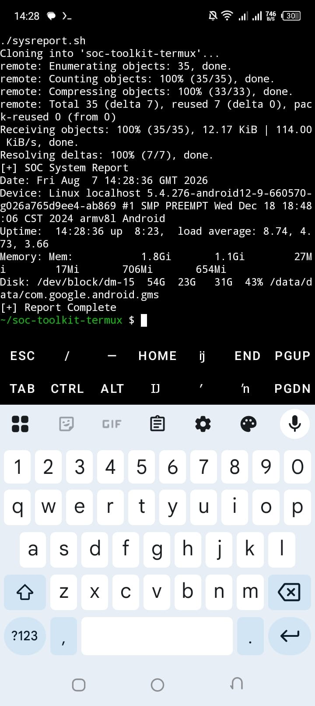

# soc-toolkit-termux

A collection of 5 Bash scripts for SOC Analysts running in Termux/Android. 
Built for log monitoring, alerting, and basic threat detection on mobile.

## 🛠️ Tools Included

| Script | Purpose |
| --- | --- |
| `logwatcher.sh` | Monitors system logs in real-time |
| `alertsystem.sh` | Sends alerts for suspicious activity |
| `portscanner.sh` | Quick port scan for local network |
| `hashchecker.sh` | Verify file integrity with MD5/SHA256 |
| `sysreport.sh` | Generate system status report |

## 🚀 Usage in Termux

### Demo


```bash
pkg update && pkg install git bash
git clone https://github.com/vascoray/soc-toolkit-termux
cd soc-toolkit-termux
chmod +x *.sh
./logwatcher.sh
```bash
pkg update && pkg install git bash
git clone https://github.com/vascoray/soc-toolkit-termux
cd soc-toolkit-termux
chmod +x *.sh
./logwatcher.sh
