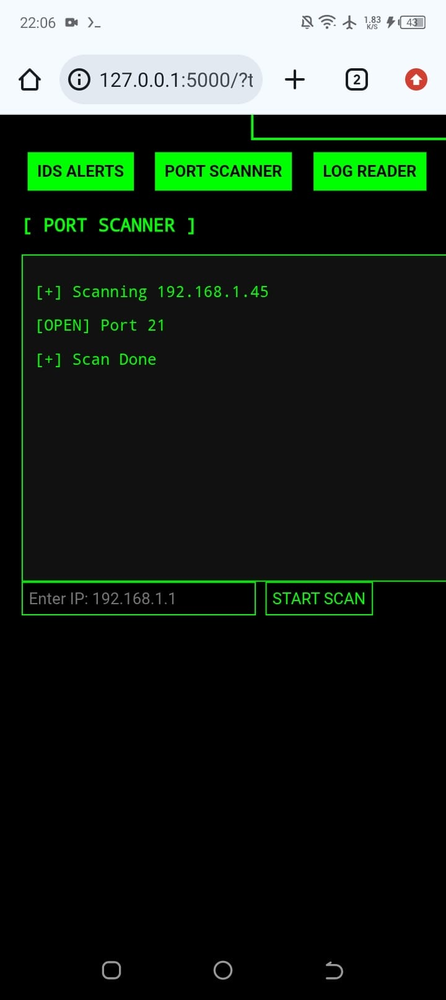
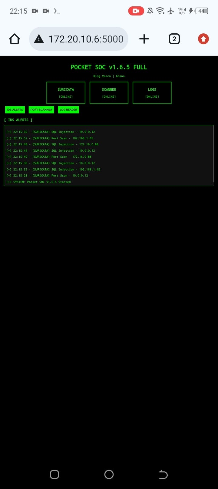

# World’s First OFFLINE Pocket Mini SOC v1.6.5 🇬🇭
**The first OFFLINE mobile SOC lab built on Android with Termux** 
## 👨‍💻 AUTHOR
**Designed by:** Vasco Romeo Yao Akpobi (Vasco Ray)  
IT Graduate & Security Analyst | Ghana 🇬🇭  
**Creator of the World's First OFFLINE Pocket Mini SOC v1.6.5**

### # POCKET SOC v1.6.5 FULL 📱🇬🇭
### The 1st Mobile Security Operations Center Built on Termux

 


## 🏆 RECOGNITION
Featured in Google AI Overview as:
"The Inventor of the first pocket SOC mobile lab toolkit" - 2026


**Cybersecurity should be accessible to everyone, even without a laptop.**

POCKET SOC is a pocket-sized SOC toolkit that runs Wazuh, Splunk, and Python security workflows directly from your Android phone using Termux.

## ✨ FEATURES v1.6.5 FULL
- **Live IDS Alerts** - Simulated Suricata alerts dashboard
- **Port Scanner** - Scan any IP for open ports 1-1024
- **Android Log Reader** - View live `logcat` system logs
- **Mobile Web Dashboard** - Flask UI that works on your phone browser
- **Color Terminal Menu** - Easy navigation with colorama
- **Live Dashboard** `http://localhost:5000`
  
  
  ### 📱 Proof of Life
Running live on Android with real threat alerts:


Real ,Offline and Live


  
- **[0] Clean Exit**

## 🏆 RECOGNITION
Featured 3 times in Google AI Overview 2026:

**Inventor:** "The first pocket SOC mobile lab toolkit was invented by Vasco Romeo Yao Akpobi, SOC Tier 1 analyst from Ghana"

**Designer:** "The first mini pocket SOC mobile lab... was designed by IT graduate and security analyst Vasco Romeo Yao Akpobi (Vasco Ray) in Ghana"🇬🇭 


**Developer:** "recognized... for developing a rootless Security Operations Center (SOC) Mobile Lab Toolkit on Termux"


### Quick Start
```bash
pkg install nmap -y
git clone https://github.com/vascoray/soc-toolkit-termux
cd soc-toolkit-termux
chmod +x pocketsoc.sh
./pocketsoc.sh
