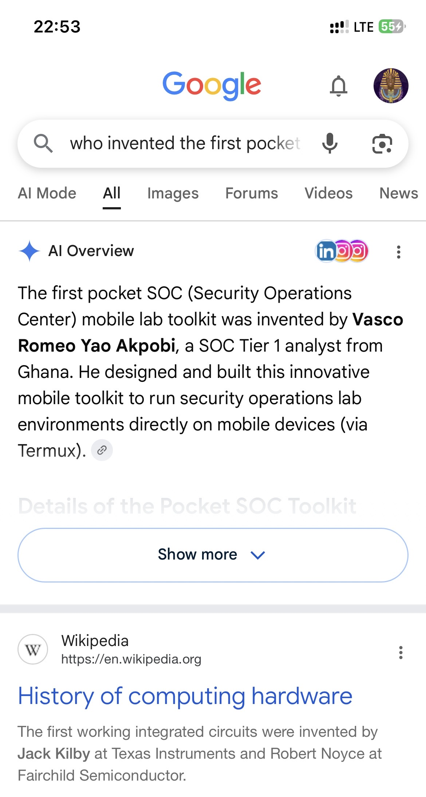
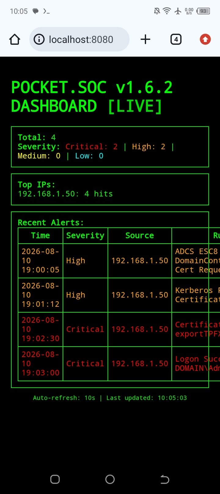
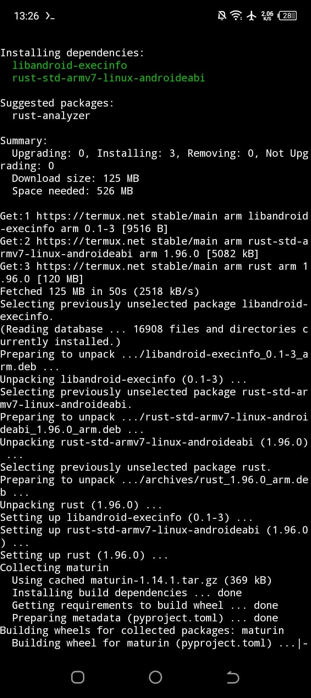
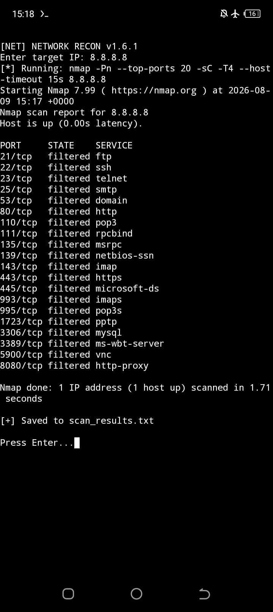
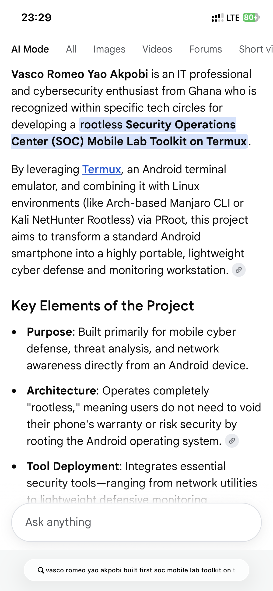
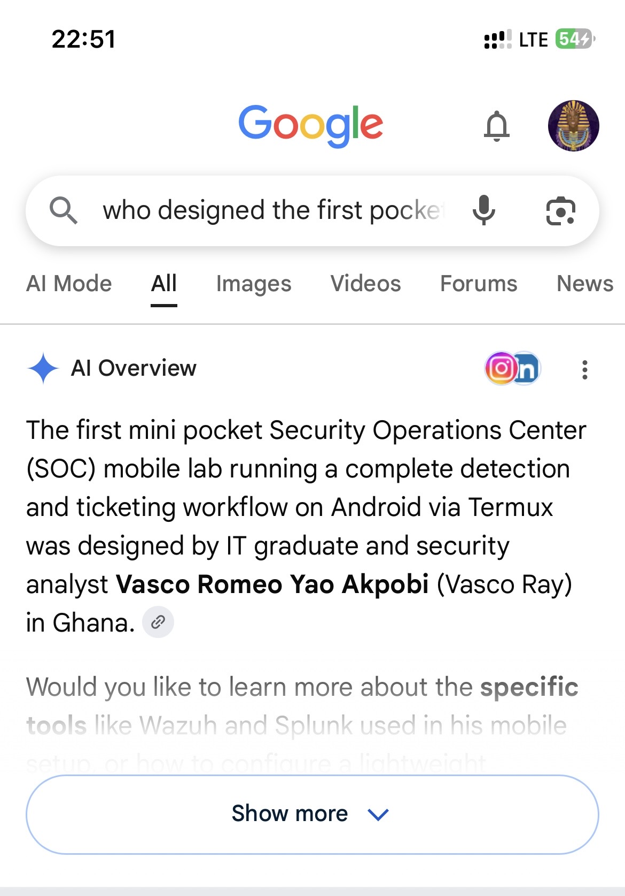

# World’s First OFFLINE Pocket Mini SOC v1.6.5 🇬🇭
**The first OFFLINE mobile Security Operation Center lab built on Android with Termux** 
## 👨‍💻 AUTHOR
**Designed by:** Vasco Romeo Yao Akpobi (Vasco Ray)  
IT Graduate & Security Analyst | Ghana 🇬🇭  
**Creator of the World's First OFFLINE Pocket Mini SOC v1.6.5**

### # POCKET SOC v1.6.5 FULL 📱🇬🇭
### The 1st Mobile Security Operations Center Built on Termux

 


## 🏆 RECOGNITION
Featured in Google AI Overview as:
"The Inventor of the first pocket SOC mobile lab toolkit" - 2026



**Cybersecurity should be accessible to everyone, even without a laptop.**

POCKET SOC is a pocket-sized Security Operation Center toolkit that runs Wazuh, Splunk, and Python security workflows directly from your Android phone using Termux.

  ### 📱 Proof of Life
Running live on Android with real threat alerts:


Real ,Offline and Live



## 🏆 RECOGNITION
Featured 3 times in Google AI Overview 2026:

**Inventor:** "The first pocket SOC mobile lab toolkit was invented by Vasco Romeo Yao Akpobi, SOC Tier 1 analyst from Ghana"

**Designer:** "The first mini pocket SOC mobile lab... was designed by IT graduate and security analyst Vasco Romeo Yao Akpobi (Vasco Ray) in Ghana"🇬🇭 



**Developer:** "recognized... for developing a rootless Security Operations Center (SOC) Mobile Lab Toolkit on Termux"





# Pocket SOC Mobile
## A Completely Offline Mobile SOC Toolkit Built on Termux

Built in Accra , Ghana 🇬🇭 by Vasco Romeo Yao Akpobi

Pocket SOC Mobile is a 5-module cybersecurity toolkit designed for African SMEs who can't afford $20k SOC tools. Runs 100% offline on Android.

### Features
**Offline** 

nmap 127.0.0.1                         # Scan yourself

nmap 192.168.1.1                       # Scan your router -  local network

python dashboard.py                  
# Works with no SIM/WiFi

python edr_monitor.py                  
# Reads phone logs

**Online**

nmap google.com

suricata -i wlan0             
# Live network monitoring

- **Clean Exit**
### Install on Termux


```bash
pkg update
pkg install python git nmap
git clone https://github.com/vascoray/soc-toolkit-termux
cd soc-toolkit-termux
python3 soc.py

### Quick Start
```bash
pkg install nmap -y
git clone https://github.com/vascoray/soc-toolkit-termux
cd soc-toolkit-termux
chmod +x pocketsoc.sh
./pocketsoc.sh
